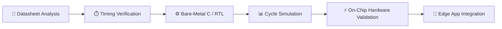

<div align="center">

  <!-- Animated Neon Waving Header -->
  

  <!-- Animated Neon Typing SVG -->
  <a href="https://github.com/VamsiReddyBora">
    
  </a>

  <br/><br/>

  <!-- Live Dynamic Profile Metrics & Badges -->
  <p align="center">
    
    
    
  </p>

  <!-- Connect Channels -->
  <p align="center">
    <a href="mailto:vamsireddy2534@gmail.com">
      
    </a>
    <a href="https://www.linkedin.com/in/vamsi-reddy-bora" target="_blank">
      
    </a>
    <a href="https://github.com/VamsiReddyBora">
      
    </a>
  </p>

</div>

---

### ⚡ Engineering Mindset & Philosophy

> *"If you understand the protocol timing — you control the system."*  
> *"Embedded engineering isn't just about code — it's about mastering silicon, state machines, and microsecond timing."*

I am an **Electronics & Communication Engineer** operating at the convergence of **bare-metal hardware systems** and **intelligent modern software**:

- 🔬 **Silicon Architecture**: Register-level programming on ARM7 / LPC2148, clock tree synthesis, and interrupt-driven deterministic routines.
- ⏱️ **Protocol Mastery**: Cycle-accurate bus implementations (I2C, SPI, UART, CAN) with datasheet-verified timing closure.
- 🤖 **Edge & Intelligent Software**: Bridging low-level systems with cutting-edge Android development (Kotlin, Jetpack Compose) and multimodal AI (Google Gemini).
- 🛡️ **Zero-Bloat Ethos**: High efficiency, offline-first execution, and total privacy by design.

---

### 🚀 Interactive Tech Stack

<div align="center">

<a href="https://skillicons.dev">
  
</a>

<br/><br/>

| Domain | Technologies & Hardware Targets |
| :--- | :--- |
| **Silicon & Microcontrollers** | `ARM Cortex-M` • `LPC2148 (ARM7)` • `Xilinx Artix-7 FPGA` • `Arduino` • `AVR/PIC` |
| **Busses & Protocols** | `I2C (Fast Mode)` • `SPI (Mode 0 / 10 MHz)` • `UART (FIFO/ISR)` • `CAN` • `RS-485` |
| **Mobile & Intelligent App Stack** | `Kotlin` • `Jetpack Compose` • `Room DB` • `Google Gemini API` • `Health Connect` |
| **Simulation & EDA Tooling** | `Xilinx Vivado` • `Keil µVision` • `Proteus Design Suite` • `LabVIEW` • `MATLAB` |

</div>

<br/>

```c
/* ====================================================================
 * Bare-Metal Register Mindset: LPC2148 / ARM7 Deterministic Bus Driver
 * ==================================================================== */
void hardware_init(void) {
    PINSEL0 |= (1 << 4) | (1 << 6);    /* P0.2 -> SCL, P0.3 -> SDA */
    I2C0SCLH = 0x00A0;                 /* Clock High Time: Deterministic 100kHz */
    I2C0SCLL = 0x00A0;                 /* Clock Low Time: Matching Duty Cycle */
    I2C0CONSET = (1 << 6);             /* I2EN: Enable Hardware I2C Engine */
}
```

---

### 🌟 Featured Repositories

<table width="100%">

  <!-- Project 1: MacroBite -->
  <tr>
    <td width="70%" valign="top">
      <h3>🍽️ <a href="https://github.com/VamsiReddyBora/MacroBite">MacroBite</a></h3>
      <p>
        A lightweight, privacy-first native <strong>Android macro & nutrition tracker</strong> powered by on-device intelligence and Google Gemini. Features 100% Jetpack Compose UI, multimodal meal logging (photo, voice & text), OpenFoodFacts barcode scanner, Health Connect sync, and offline SQLite Room storage.
      </p>
      <p>
        
        
        
        
      </p>
    </td>
    <td width="30%" align="center" valign="middle">
      <a href="https://github.com/VamsiReddyBora/MacroBite">
        
      </a>
      <br/><br/>
      
    </td>
  </tr>

  <!-- Project 2: PowerChrono -->
  <tr>
    <td width="70%" valign="top">
      <h3>⚡ <a href="https://github.com/VamsiReddyBora/PowerChrono-The-Future-of-Time-Driven-Energy-Automation">PowerChrono: Time-Driven Energy Automation</a></h3>
      <p>
        An intelligent, time-based industrial power management and energy automation system. Automates electrical devices and industrial loads according to deterministic scheduling matrices, drastically cutting energy wastage and maximizing grid reliability.
      </p>
      <p>
        
        
        
        
      </p>
    </td>
    <td width="30%" align="center" valign="middle">
      <a href="https://github.com/VamsiReddyBora/PowerChrono-The-Future-of-Time-Driven-Energy-Automation">
        
      </a>
      <br/><br/>
      
    </td>
  </tr>

  <!-- Project 3: I2C-Protocol -->
  <tr>
    <td width="70%" valign="top">
      <h3>🔌 <a href="https://github.com/VamsiReddyBora/I2C-Protocol">I2C Protocol Implementation (LPC2148 ARM7)</a></h3>
      <p>
        Register-level bare-metal implementation of the <strong>I2C communication protocol</strong> on the <strong>LPC2148 ARM7</strong> microcontroller. Emphasizes bit timing, START/STOP condition generation, ACK/NACK state validation, and peripheral memory interfacing without HAL overhead.
      </p>
      <p>
        
        
        
        
      </p>
    </td>
    <td width="30%" align="center" valign="middle">
      <a href="https://github.com/VamsiReddyBora/I2C-Protocol">
        
      </a>
      <br/><br/>
      
    </td>
  </tr>

  <!-- Project 4: AI_CLI -->
  <tr>
    <td width="70%" valign="top">
      <h3>🤖 <a href="https://github.com/VamsiReddyBora/AI_CLI">AI_CLI: Intelligent Developer Terminal Assistant</a></h3>
      <p>
        An intelligent command-line assistant designed to accelerate developer workflows, automate shell operations, and bring conversational AI intelligence directly into native terminal environments.
      </p>
      <p>
        
        
        
      </p>
    </td>
    <td width="30%" align="center" valign="middle">
      <a href="https://github.com/VamsiReddyBora/AI_CLI">
        
      </a>
      <br/><br/>
      
    </td>
  </tr>

  <!-- Project 5: Digital-Identity -->
  <tr>
    <td width="70%" valign="top">
      <h3>🌐 <a href="https://github.com/VamsiReddyBora/Digital-Identity">Digital Identity (Web Portfolio)</a></h3>
      <p>
        Interactive personal web showcase and digital identity platform highlighting engineering projects, low-level architecture demos, responsive UI animations, and technical achievements.
      </p>
      <p>
        
        
      </p>
    </td>
    <td width="30%" align="center" valign="middle">
      <a href="https://github.com/VamsiReddyBora/Digital-Identity">
        
      </a>
      <br/><br/>
      
    </td>
  </tr>

</table>

---

### 🔄 System Engineering Pipeline



---

### 🔥 GitHub Streak & Contribution Activity

<div align="center">
  
</div>

---

### 🤝 Connect With Me

<div align="center">

  <p>Always excited to connect on <strong>embedded firmware, hardware timing, or AI engineering</strong>!</p>

  <a href="mailto:vamsireddy2534@gmail.com">
    
  </a>
  <a href="https://www.linkedin.com/in/vamsi-reddy-bora" target="_blank">
    
  </a>

  <br/><br/>

  <!-- Animated Neon Waving Footer -->
  

</div>